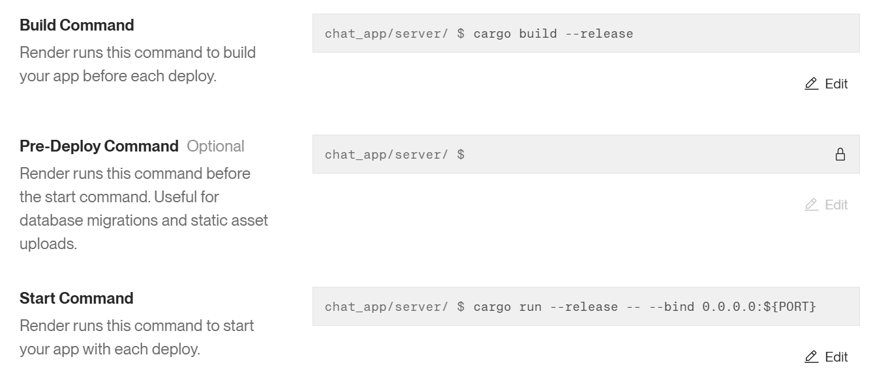

There are a total of 4 projects in this folder.

| Project | targets |
|---|---|
|client | native client (ratatui) |
| server | simple server that only exposes a single websocket |
| wasm_client | egui client compiled to wasm, runnable in a browser |
| wasm_server | unlike the name suggests, the server is still natively compiled. It's the server for the wasm client, it includes both the websocket and also serves the static files for the client. |


---------------------------------------------------


For the server:

```
cargo run -p server -- --bind 0.0.0.0:8085
```

---------------------------------------------------

For the client:

```
cargo run -p client -- --url ws://localhost:8085
```

----------------

For the browser:

```
# one time
cargo install --locked trunk

# in wasm_client
trunk build --release

# in wasm_server
cargo run
#  or
cargo build --release
```

----------------

An instance of the server is also hosted at render.com.



You may connect to it via:

```
cargo run -p client -- --url wss://ractor-wormhole-chat-app-server.onrender.com
```